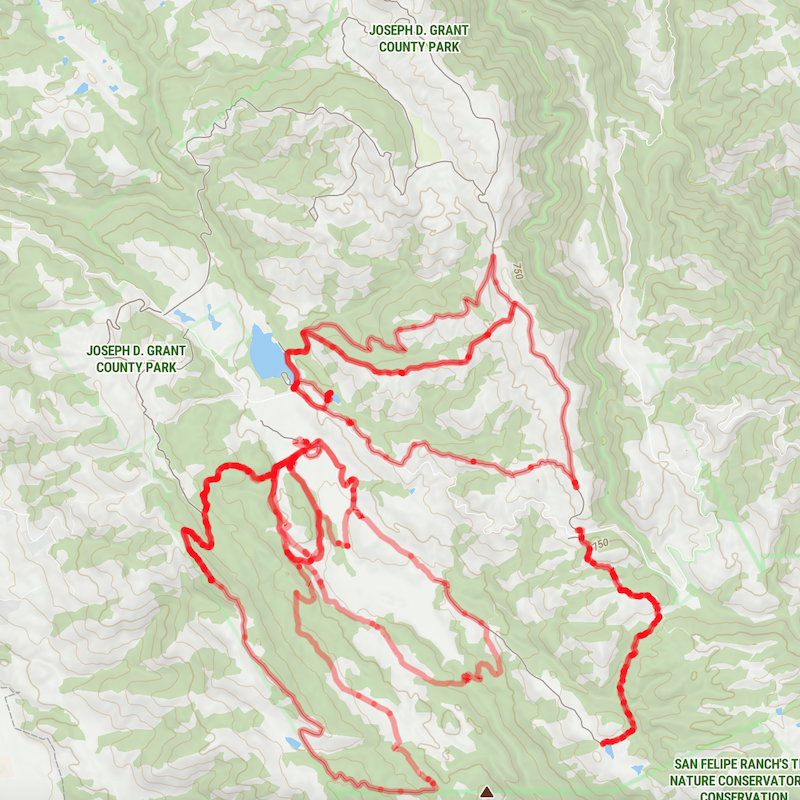
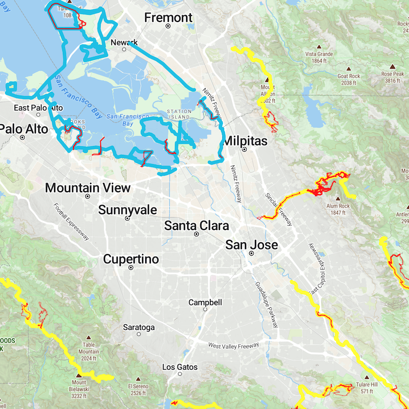

# Local activity map

Get activity data data GPX files from Strava and display on a Map Tiler map.

Display the [San Francisco Bay Trail](https://mtc.ca.gov/operations/regional-trails-parks/san-francisco-bay-trail/bay-trail-interactive-map) and the [Bay Area Ridge Trail](https://ridgetrail.org/) with overlapping activities.

Use [Map Tiler](https://www.maptiler.com/) to create two maps: one with all activities, and another with
the activities that overlap the Bay and Ridge trails. Use these maps to discover and plan new activities.

 


# setup

Install requirements: `pip install -r requirements.txt`

Use [bboxfinder.com](http://bboxfinder.com/#0.000000,0.000000,0.000000,0.000000) to find coordinates for
a local bounding box. Set the bounding box coordinates in the environment: 
`BOUNDING_BOX=-122.732314,36.916954,-120.977248,37.699028`

Download activity data from Strava: [Download or Delete Your Account](https://www.strava.com/athlete/delete_your_account) then Download Request / Request Your Archive. Wait for an email, then download the archive
and copy to `strava.zip`.

Get an API key from [Map Tiler](https://docs.maptiler.com/cloud/api/authentication-key/).

Create `config.js` and set Map Tiler API key and path for data files:

```
const MAP_TILER_API_KEY = "xxx";
const HOST = 'http://localhost:8000/output'
```

# run

## initial

```
make download-strava prep-strava prep-ridge prep-shoreline overlap
```

### Strava data

Download GPX files (one per activity) from Strava and combine into a geojson file for display on a map.

Run `make download-strava` to unzip Strava GPX files in `strava.zip` to `strava/activities`.

Run `make prep-strava` to combine Strava GPX tracks within a bounding box to `output/routes_gz.geojson`.

### San Francisco Bay Trail

The San Francisco Bay Trail interactive map data is already in GeoJSON format: https://mtc.ca.gov/modules/custom/mtcca_baytrail_map/sf_baytrail.geojson. Save to `bay_trail/bay_trail.geojson`.

Run `make prep-shoreline` to filter the data to a subset of fields for existing, in use trails and write to `output/bay_trail.geojson`.

### Bay Area Ridge Trail

The Bay Area Ridge Trail doesn't seem to have trail data in geodata format. The [Bay Area Ridge Trail list](https://www.alltrails.com/lists/bay-area-ridge-trail--23) on AllTrails includes 76 trails; click Download route on
an individual trail page to download a GPX file for that segment. This downloads files with a `.js` (not `.gpx`) extension, although the data format is GPX.

Run `make prep_ridge` to combine GPX files in in `ridge_trail/` to GeoJSON format in `output/ridge_trail.geojson`.

### Generate overlapping trail data

Run `make overlap` to combine trail data (`output/bay_trail.geojson`, `output/ridge_trail.geojson`) with
Strava activity data (`output/routes.geojson`). Write overlapping routes to `output/trail_routes.geojson`.

## updates

```
make download-strava prep-strava overlap
```

Download Strava data to `strava.zip`, add new routes to `output/routes.geojson`, and re-create overlapping
route / trail data.

Run `make sync` to sync data to S3 bucket in `S3_BUCKET` environment variable.

## view map

Start local server: `python -m http.server`

View activity heatmap: http://localhost:8000/index.html

View activity heatmap with Bay trails: http://localhost:8000/bay.html


# resources

  - [bboxfinder](http://bboxfinder.com/#51.830755,4.742883,52.256198,5.552837) draw and get coordinates for a bounding box
  - [geopandas](https://geopandas.org/en/stable/getting_started/introduction.html) load GPX and GeoJSON files, apply geometric algorithms, and write GeoJSON
  - [gpxpy](https://github.com/tkrajina/gpxpy) read activity metadata from GPX files
  - [MapTiler](https://docs.maptiler.com/sdk-js/examples/) JavaScript SDK with excellent documentation and examples
  - [MapTiler Polyline helper](https://docs.maptiler.com/sdk-js/api/helpers/#polyline) example usage for drawing GeoJSON on a map
  - [about vector tiles](https://www.maptiler.com/news/2019/02/what-are-vector-tiles-and-why-you-should-care/)
