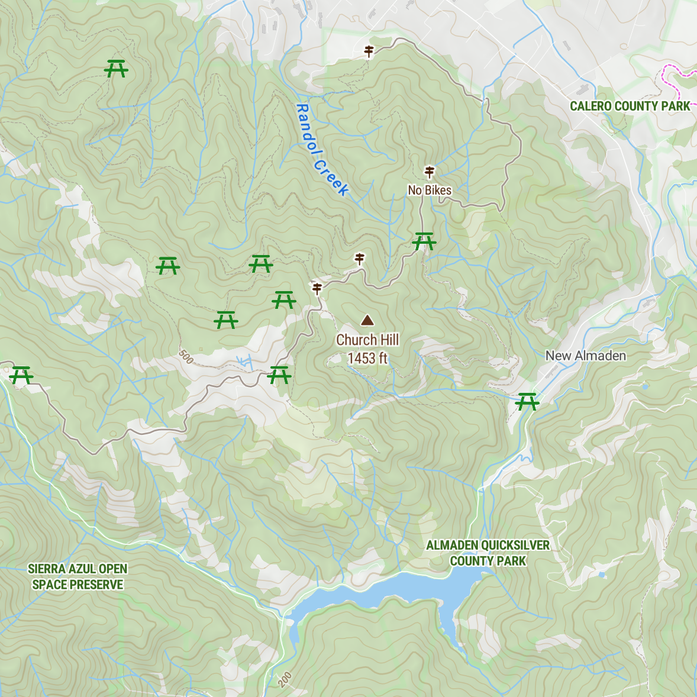

# Picnic map

Query [Open Street Map for picnic tables](https://taginfo.openstreetmap.org/tags/leisure=picnic_table#overview)
with the [Overpass API](https://dev.overpass-api.de/overpass-doc/en/index.html), and
display on a [Map Tiler map](https://docs.maptiler.com/sdk-js/).



## How it works

At zoom level 12 (city) or higher, query the Overpass API for picnic tables using the map's bounding box.

Convert the data from the Overpass API to GeoJSON, then update map's data source to display picnic table markers
on a symbol layer.

## Tools

There are more than 325,000 picnic tables tagged in the Open Street Map geographic database. These are often
displayed only at very high zoom levels (as in Map Tiler's `MapStyle.OPENSTREETMAP`) or not at all
(Google Maps).

The Overpass API is a search interface to the Open Street Map geographic database. The API
is exotic and likely inaccessible for non-engineers. Send this query as a POST request to get picnic tables:

```
[out:json];
node
    [leisure=picnic_table]
    (37.278,-121.975,37.372,-121.763);
out skel;
```

This returns picnic table locations in JSON format:

```
{
  "version": 0.6,
  "generator": "Overpass API 0.7.62.1 084b4234",
  "osm3s": {
    "timestamp_osm_base": "2024-05-16T19:25:45Z",
    "copyright": "The data included in this document is from www.openstreetmap.org. The data is made available under ODbL."
  },
  "elements": [
  {
    "type": "node",
    "id": 4576249494,
    "lat": 37.4261980,
    "lon": -121.9225012
    },
...
  ]
}
```

Map Tiler provides a well-documented JavaScript SDK that makes it simple to build an interactive map
with GeoJSON data.


