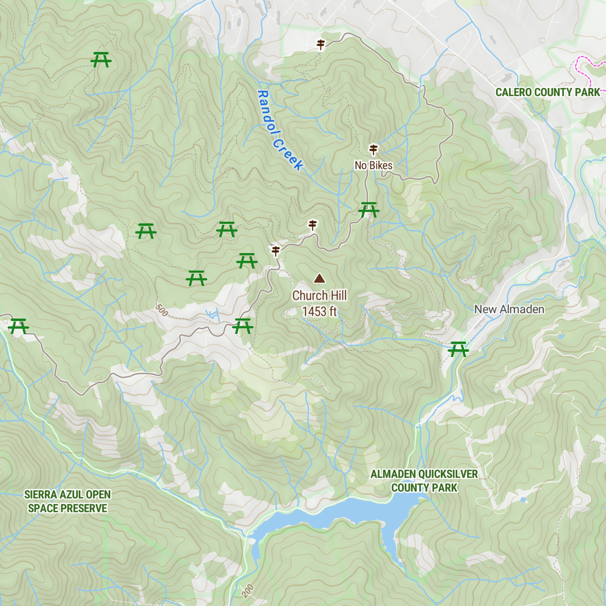

# Picnic map

Build a static [FlatGeobuf](https://flatgeobuf.org/) file of
[picnic tables from Open Street Map](https://taginfo.openstreetmap.org/tags/leisure=picnic_table#overview)
(US only, for now), and display it on a
[Map Tiler map](https://docs.maptiler.com/sdk-js/).

## How it works

`prep_picnic.py` builds the static data file, offline:

1. `download_osm` downloads Geofabrik regional `.osm.pbf` extract(s) to
   `OSM_DATA_DIR`.
2. `parse_pbf` filters that extract with `ogr2ogr` to
   `leisure=picnic_table` nodes.
3. `parse_osm` loads the filtered nodes for every downloaded region into
   GeoPandas, strips them to just `id` + point geometry, drops duplicates, and writes
   `output/picnic.fgb`.

`parse_pbf` shells out to `ogr2ogr`, part of [GDAL](https://gdal.org/).
It's a system binary, not a Python package, so it isn't in
`requirements.txt` — install it separately (e.g. `brew install gdal`)
before running `prep_picnic.py parse`.

At zoom level 11 (city) or higher, the client (`map.js`) queries
`output/picnic.fgb` directly for the map's current bounding box, using
FlatGeobuf's built-in packed Hilbert R-tree spatial index and HTTP range
requests to fetch only the bytes covering the visible area. There's no
server or database involved. The browser a static file served over HTTP range
requests, not the whole (~13M) file.

## Tools

There are more than 325,000 picnic tables tagged in the Open Street Map
geographic database. These are often displayed only at very high zoom
levels (as in Map Tiler's `MapStyle.OPENSTREETMAP`) or not at all
(Google Maps).

[FlatGeobuf](https://flatgeobuf.org/) is a compact binary format for
geospatial vector data with a built-in spatial index, letting a client
query a bounding box over HTTP range requests without loading or indexing
the whole file itself. This replaced an earlier version of this map that
queried the [Overpass API](https://dev.overpass-api.de/overpass-doc/en/index.html)
live from the browser on every pan since the API was often unreliable.

Map Tiler provides a well-documented JavaScript SDK that makes it simple to build an interactive map with GeoJSON data.

## Updates

`make refresh-picnic` - download Open Street Map data, filter to picnic table features, and write to FlatGeobuf file. Parsing US + Canada (17G GB data files, 126k picnic tables) takes about 10 minutes.

`make sync-picnic` - copy files to AWS S3 bucket

`python prep_picnic.py download --region north-america/canada` - download data for region(s) (region is a comma-delimited)
